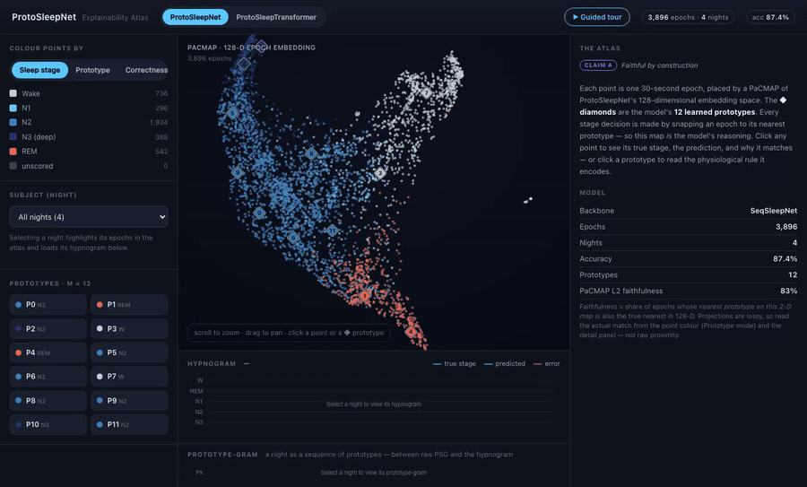
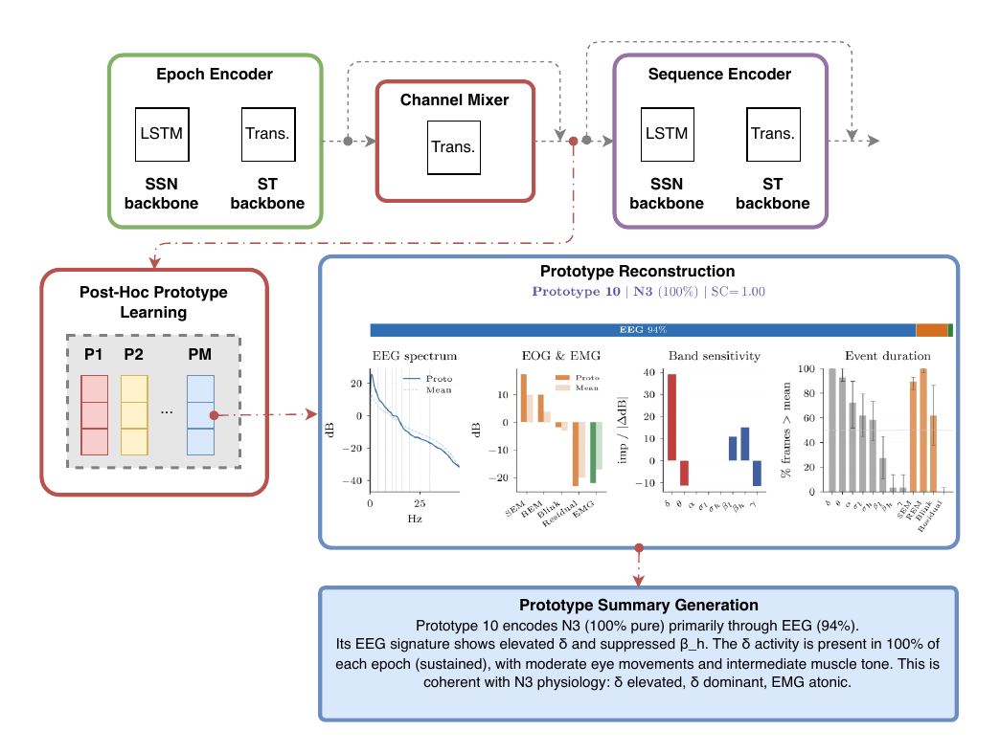

# ProtoSleepNet

**Prototype-based, interpretable sleep staging — where reading the prototypes _is_ reading the decision.**

[](https://doi.org/10.21203/rs.3.rs-9169987/v1)
[](https://guidogagl.github.io/protosleepnet)
[](https://protosleepnet-demo.pages.dev)
[](https://github.com/guidogagl/protosleepnet/blob/main/LICENSE)
[](https://github.com/guidogagl/protosleepnet/blob/main/pyproject.toml)
[](https://github.com/guidogagl/physioex)
<!-- [](https://doi.org/10.5281/zenodo.XXXXXXX)  -- minted at release -->

Code for **"Prototype-based interpretable sleep staging with physiologically
meaningful sub-stage pattern discovery"** (ProtoSleepNet), under review at
*npj Digital Medicine*. The revised manuscript (v2) is on the
[project website](https://guidogagl.github.io/publications/); version 1 is on
Research Square,
[10.21203/rs.3.rs-9169987/v1](https://doi.org/10.21203/rs.3.rs-9169987/v1),
under an earlier title.

> ▶ **Try it live — [protosleepnet-demo.pages.dev](https://protosleepnet-demo.pages.dev)** — an interactive atlas of the prototype space: click any epoch to see the exact evidence for its stage.

[](https://protosleepnet-demo.pages.dev)

ProtoSleepNet wraps a sleep-staging backbone (SeqSleepNet or SleepTransformer)
with a **Prototype Sub-Stage (PSS)** module: per-channel encoding, modality
embeddings, inverse-accuracy channel dropout, a Transformer channel mixer and a
dual-residual path, yielding contextualized epoch embeddings that are quantized
into a small, interpretable **prototype codebook**. The prototypes carry
physiologically meaningful, AASM-coherent sub-stage patterns and support
exploratory clinical probing (Alzheimer's, Parkinson's).

**📖 Documentation: [guidogagl.github.io/protosleepnet](https://guidogagl.github.io/protosleepnet)** — method overview, a guide to *how to interpret the model*, the embedded live demo, and the full paper-reproduction recipe.



> **Built on [physioex](https://github.com/guidogagl/physioex) v2.0.0.**
> <a href="https://github.com/guidogagl/physioex"></a>
>
> The model architecture, data loaders, preprocessing, dataset splits, seeds and
> evaluation metrics all live in `physioex`. **This** repository holds only the
> **experiment pipeline** that produced every figure and table in the paper.

## Installation

```bash
conda env create -f environment.yml && conda activate protosleepnet   # optional
pip install -e .                     # installs the `protosleepnet` package + physioex==2.0.0
```

Requires Python ≥ 3.10. After `pip install -e .` every script runs as a module
from the repo root — **one** convention throughout:

```bash
python -m protosleepnet.train --help
python -m protosleepnet.figure_reconstruction.spectral_signature --help
```

## Pretrained weights

Weights are on the HuggingFace Hub and load through physioex. Names follow the
physioex convention `<model>-<primary-author>`. The paper's models live in
[`4rooms/sleep-prototypes`](https://huggingface.co/4rooms/sleep-prototypes)
(the Phan originals `{seqsleepnet,sleeptransformer}-phan` are in `4rooms/physioex`):

```python
from physioex.models import load_from_pretrained
# PST — SleepTransformer backbone (SHHS, L=21)
model = load_from_pretrained("protosleeptransformer-gagliardi", repo_id="4rooms/sleep-prototypes")
# PSN — SeqSleepNet backbone (MASS, L=20)
# load_from_pretrained("protosleepnet-gagliardi", repo_id="4rooms/sleep-prototypes")
# input  (batch, L, 3, 29, 129) STFT log-power (EEG/EOG/EMG); output (batch, L, 5) AASM logits
```

The 3-channel baselines and ablation variants are published alongside them:
`{seqsleepnet,sleeptransformer}-gagliardi[-dropout|-mixer]`.

`bash reproduce.sh` runs a smoke path (load weights → forward pass → regenerate one figure).

## Data

11 PSG datasets / 20 dataset-sources (12,317 subjects). Raw recordings are **not**
redistributed here — obtain them from the sources below and preprocess them with
**physioex** (this repo depends on physioex's preprocessing; it ships none of its own).
See the physioex docs and the launchers in `examples/slurm/`.

| Datasets | Access |
|---|---|
| SHHS, MrOS, MESA, WSC, HomePAP | NSRR — controlled/registered (https://sleepdata.org) |
| HMC, Sleep-EDF | PhysioNet — open |
| MASS, DCSM | open on request |
| ASD (Alzheimer), KPD (Parkinson) | KU Leuven — restricted (contact authors; ethics S61792/S70708) |

## Configuration (environment variables)

Scripts read paths from the environment so no absolute paths are baked in:

| Variable | Meaning | Default |
|---|---|---|
| `PROTOSLEEPNET_DATA` / `EXPERIMENT_DIR` | root for predictions, embeddings, reconstruction outputs | `data` |
| `PROTOSLEEPNET_MODELS` | checkpoints / training stats | `<DATA>/models` |
| `PROTO_RECON_SRC` | reconstruction source arrays (optional; else symlink `reconstructions_bulk/`) | — |
| `PHYSIOEX_ROOT` | physioex checkout (only if running physioex from source, not pip) | — |

Cluster launchers additionally source `examples/slurm/env.sh` (copy from
`examples/slurm/env.sh.example`).

## Repository layout

```
src/protosleepnet/            # installable package (run as python -m protosleepnet.<mod>)
  train.py  test_*.py  extract_*.py  seed_*.py   # staging training/eval + seed-stability
  build_protosleepnet.py                          # shared model factory
  ablation/  baselines/                           # ablation & residual/mixer/dropout variants
  posthoc_prototypes/  proto_reconstruction/      # VQ codebook learning + reconstruction
  figure_reconstruction/                          # prototype cards / rules / spectral & relevance signatures
  probing/  clinical_probing/                      # clinical probing (AD/PD) compute + analysis
  ood_disease/                                     # OOD disease evaluation / transport
  plot/                                            # portable figure scripts (from predictions)
examples/slurm/    # cluster launchers (Leonardo/Sofia); copy env.sh.example -> env.sh
notebooks/         # global_explain.ipynb, local_explain.ipynb
data/              # small committed figure-source JSON only (see below)
tests/             # smoke tests (import graph + optional pretrained forward pass)
```

Large artifacts (predictions, embeddings, reconstruction arrays, checkpoints) are
**not** in git — they live in a backup root and are wired in via the git-ignored
`json/` and `reconstructions_bulk/` symlinks. Only small figure-source JSON is
committed under `data/`.

## Reproducing the paper (Figure/Table → experiment → command)

Each command below is the entry point; pass `--help` for its options. Full
experiment settings (M value, seeds, datasets) are documented per-script.

| Paper asset | Experiment | Command |
|---|---|---|
| Fig 2a; Supp §1 | In-domain + OOD staging, per-class, confusion, stats | `python -m protosleepnet.train`; `python -m protosleepnet.test_pretrained` |
| Fig 2b; Supp §3,§8 | M-sweep, residual/VQ robustness, VQ methods, randomization | `python -m protosleepnet.posthoc_prototypes.learn_prototypes_vq`; `python -m protosleepnet.plot.residual`; `python -m protosleepnet.plot.vq` |
| Supp §2 | Ablation (4 component variants) + occlusion robustness | `python -m protosleepnet.ablation.train_ablation --variant {baseline,dropout,mixer,protosleepnet}` (SleepTransformer) / `...train_ablation_seqsleepnet ...` (SeqSleepNet); `python -m protosleepnet.plot.occlusion` |
| Fig 4; Supp §5,§6 | Prototype reconstruction (data/model/hybrid) + cross-dataset | `python -m protosleepnet.proto_reconstruction.data_driven` (`.model_driven`, `.hybrid`); `python -m protosleepnet.figure_reconstruction.compute_cross_dataset_metrics` |
| Fig 3; Tab 1,2; Supp §4,§6 | Codebook summaries, band-ablation rules, coherence, local IG | `python -m protosleepnet.figure_reconstruction.{rule_learning,spectral_signature,relevance_signature,compute_local_explanations,combinatorial_ablation}` |
| Supp §9 | Seed stability | `python -m protosleepnet.seed_stability_pipeline` |
| Fig 5; Supp §7 | Clinical probing (AD/PD), frozen-model LOSO | `python -m protosleepnet.clinical_probing.staging.extract_embeddings`; `python -m protosleepnet.probing.{parkinsons,alzheimers}.diagnosis_probe`; `python -m protosleepnet.clinical_probing.{parkinsons,alzheimers}.analyze_features` |

Manuscript figure/table *assembly* (LaTeX-coupled emitters) is kept out of this
repo, with the paper sources.

## Tests

```bash
pip install -e . pytest
pytest                 # import-graph smoke test (no network)
pytest --runslow       # also pull weights from HuggingFace and run a forward pass
```

## Citation

If you use this code, please cite the paper and the software — see `CITATION.cff`
(paper + software Zenodo DOI). This work builds on
[physioex](https://github.com/guidogagl/physioex) v2.0.0. License: MIT (`LICENSE`).
