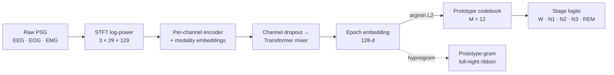

# Overview

**ProtoSleepNet** is a *prototype-based, interpretable* sleep-staging model. It
wraps a standard staging backbone (SeqSleepNet or SleepTransformer) with a
**Prototype Sub-Stage (PSS)** module that quantizes each 30-second epoch's
contextualized embedding onto a small, learned **codebook of $M=12$
prototypes**. A sleep stage is then decided by *which prototypes an epoch
resembles* — so reading the prototypes *is* reading the decision.

This is the companion documentation to the paper **"Prototype-based
interpretable sleep staging with physiologically meaningful sub-stage pattern
discovery"** (in press, *npj Digital Medicine*), and to the **interactive
explainability demo**.

:::{admonition} ▶ Try it live
:class: tip
Explore the prototype atlas, click any epoch to see the evidence for its stage,
and open the prototype cards: **<https://protosleepnet-demo.pages.dev>**. The
{doc}`demo` page embeds it directly.
:::

## How the model reasons

Each epoch is embedded into a 128-dimensional space, matched to its **nearest
prototype** (squared-L2), and staged from the prototypes it activates. Because
the codebook is small and each prototype is stage-specialized, the model is
**faithful by construction**: there is no post-hoc surrogate between the
explanation and the prediction.

## The claims this documentation demonstrates

The demo and the {doc}`interpret` guide are organized around the paper's
explainability claims that a single public cohort can substantiate:

| | Claim | Where you see it |
|---|---|---|
| **A** | **Faithful by construction** — the model reasons *only* through similarity to the 12 prototypes. | The atlas + the nearest-prototype (L2) panel. |
| **B** | **Every decision is traceable** — each epoch is staged via its nearest prototype, with Integrated-Gradients evidence. | Epoch detail + per-epoch IG + hypnogram position. |
| **C** | **Monosemantic prototypes** — each of the 12 is a pure, stage-specialized pattern. | Prototype cards (purity / monosemanticity). |
| **D** | **Clinically meaningful microstructure** — signatures follow AASM physiology. | Rules, band/channel relevance, spectral envelope, and the {doc}`interpret` audit. |
| **G** | **Prototype-gram** — the full-night prototype sequence is a new representation between raw PSG and the hypnogram. | The prototype-gram ribbon under each recording. |

Claims **E** (no accuracy cost vs. the black-box backbone) and **F**
(cross-dataset transfer and disease biomarkers) require multiple cohorts and are
covered in the paper — the demo does not fabricate single-cohort visuals for
them.

## What is in this repository

This repo is the **experiment pipeline** that produced every figure and table in
the paper. The model, data loaders, preprocessing, dataset splits, seeds and
metrics all live in [physioex](https://github.com/guidogagl/physioex) v2.0.0.

- {doc}`install` — set up the package and load the pretrained weights.
- {doc}`interpret` — **how to read the prototypes and per-epoch explanations**.
- {doc}`demo` — the embedded live atlas and a claim-by-claim walkthrough.
- {doc}`reproduce` — regenerate each paper figure/table from its command.
- {doc}`/api/protosleepnet/index` — the full module reference (auto-generated).
